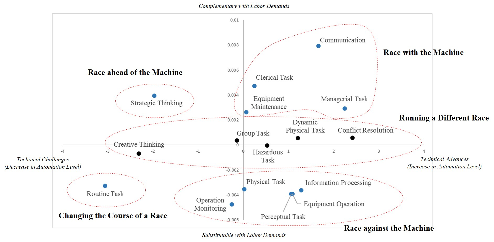

# A Data-Driven Exploration of the Race between Man and Machine
Anxiety about automation is prevalent in this era of rapid technological advances especially in artificial intelligence, machine learning, and robotics. However, not all technical advances put occupations at risk, but rather they would substitute for some tasks and complement others. Thus, the question is that which tasks are more, or less, susceptible to automation in the 21st century, in terms of (i) technical advances and (ii) substitution and complementarity in the labor markets. To this end, we initiate this research project entitled "A Data-Driven Exploration of the Race between Man and Machine". As part of the project, the online system provides the task-level susceptibility to automation across occupations and cities in the United States.

## Link
- Working Paper [[Paper]()]
- Job Automation Index System [[Homepage](http://www.jobautomationindex.com/)]
- Contact
    - Jiyong Park, Bryan School of Business and Economics, University of North Carolina at Greensboro [[Link](http://jiyong-park.github.io/)]
    - Jongho Kim, College of Business, Korea Advanced Institute of Science and Technology [[Link](http://jonghkim.github.io/)]

## About the Project
Given that technology directly affects the demand for specific skills, instead of acting on whole occupations, the impacts of automation technology vary widely according to task types. Thus, it is important to understand the types of tasks that are more, or less, susceptible to technological advances; as Peter Drucker stated, “proper measurement of information will lead to advances in effectiveness and performance of management.” To this end, we initiated this research project to empirically explore the evolution of task automation during 2008-2018.

For a data-driven exploration of the race between human tasks (man) and automation technology (machine), we introduce a network-based methodology that reveals the latent task types across occupations. We then measure the task-level degree of automation and evaluate task complementarity, or substitutability, with the demands for occupations in which such a task is performed. As a result, we classify the revealed task types into distinct categories according to their relations to automation technology and labor demands in the 21st century. 

Based on our analysis, we provide this online system to encourage further research and policy discussions on the societal challenge of automation and the future of work. This tool provides the task-level susceptibility to automation across occupations and cities in the United States. The task-level decomposition of automation level will provide a more granular understanding of how technical advances and automation affect occupations and our communities.

This system consists of five functions, the first three of which are at occupation level and the last two at city level:

#### (1) [Job Automation Index](http://www.jobautomationindex.com/automation_index/)
  - Visualize an occupation’s relations to automation during 2008-2018
#### (2) [Task-Level Automation](http://www.jobautomationindex.com/task_level_automation/)
  - Sort all occupations by task-level susceptibility to automation during 2008-2018
#### (3) [Skill DNA of Jobs](http://www.jobautomationindex.com/skill_map/)
  - Visualize an occupation’s skill requirements and skill-level susceptibility to automation during 2008-2018
#### (4) [Map of Automation (U.S. Cities)](http://www.jobautomationindex.com/map_automation/)
  - Visualize a city’s relations to automation in the United States during 2008-2018
#### (5) [City-Level Automation](http://www.jobautomationindex.com/city_level_automation/)
  - Sort all U.S. cities by task-level susceptibility to automation during 2008-2018

The entire source code is publicly accessible to encourage reproducibility at [Github Link](https://github.com/jonghkim/job-automation-index). Please see our research paper for detailed descriptions behind the job automation index.

We hope our research and this online system can encourage further research and policy discussions on the societal challenge of automation and the future of work. We welcome any comments and feedback.

## Usage of Code
- Python 2.7
- pip install -r requirements.txt
- python job_automation_index.py

## Acknowledgement
The following MIT-licensed code, created by Frank Elavsky, was used to create interactive visualization for the map of automation. [Link](https://github.com/nuitrcs/kellogg_insight_city_automation)