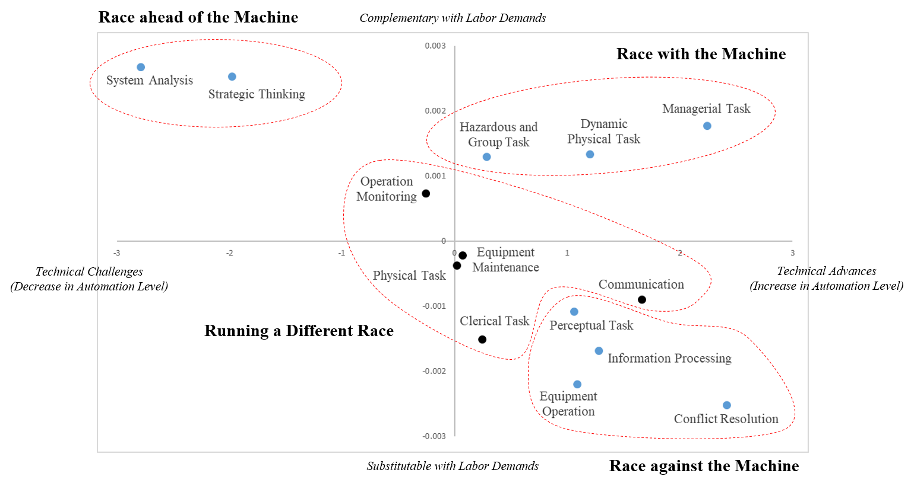

# A Data-Driven Exploration of the Race between Man and Machine
Anxiety about automation is prevalent in this era of rapid technological advances especially in artificial intelligence, machine learning, and robotics. Given that technology directly affects the demand for specific skills, instead of acting on whole occupations, the impacts of automation technology vary widely according to task types. To understand the types of tasks that are more, or less, susceptible to technological advances in the 21st century, we initiated this research project entitled "A Data-Driven Exploration of the Race between Man and Machine." As part of the project, the online system provides the task-level susceptibility to automation for each occupation.

## Link
- Working Paper [[Paper]()]
- Job Automation Index System [[Homepage](http://www.jobautomationindex.com/)]
- Contact
    - Jiyong Park, Bryan School of Business and Economics, University of North Carolina at Greensboro [[Link](http://jiyong-park.github.io/)]
    - Jongho Kim, College of Business, Korea Advanced Institute of Science and Technology [[Link](http://jonghkim.github.io/)]

## About the Project
Given that technology directly affects the demand for specific skills, instead of acting on whole occupations, the impacts of automation technology vary widely according to task types. Thus, it is important to understand the types of tasks that are more, or less, susceptible to technological advances; as Peter Drucker stated, “proper measurement of information will lead to advances in effectiveness and performance of management.” To this end, we initiated this research project to empirically explore the evolution of task automation during 2008-2018.

Firstly, we introduced a data-driven approach to reveal the latent task types in various occupations. We then measure the task-level degree of automation and task complementarity with respect to the demand for occupations in which such a task is performed. As a result, we classify the revealed task types into distinct categories according to their relation to automation technology in the 21st century. First, we identify four task types that are associated with the reduction in labor demands, even as the degree of automation of these tasks has increased (race against the machine)—clerical task, information processing, communication, and conflict resolution. Second, managerial tasks and dynamic physical tasks are in demand in the labor market, although their degree of automation has increased (race with the machine). Third, human labors appear to race ahead of the machine in two tasks—strategic thinking and system analysis—because they are associated with an increase in labor demands and their automation levels have also decreased. Finally, the remaining tasks—mostly manual—seem not to be significantly associated with the automation technology (run a difference race); these include hazardous and group task, outdoor labor, operation monitoring, equipment maintenance, equipment operation, and physical task.

Based on our analysis, we provide this online system to encourage further research and policy discussions on the societal challenge of automation and the future of work. This tool provides the task-level susceptibility to automation of each occupation. Given that not all technical advances put occupations at risk, the task-level decomposition of automation level allows us to evaluate an occupation’s susceptibility to automation according to different dimensions of the impact of automation technology. 

This system consists of four functions:

#### (1) [Automation Index](http://www.jobautomationindex.com/automation_index/)
  - Provide basic information and task-level susceptibility to automation for each occupation in 2008 and 2018
#### (2) [Automation Ranking](http://www.jobautomationindex.com/automation_ranking/)
  - Sort all occupations by the relationship to automation technology in 2008 and 2018
#### (3) [Task Level Automation](http://www.jobautomationindex.com/task_level_automation/)
  - Sort all occupations by task-level susceptibility to automation in 2008 and 2018
#### (4) [Skill Map](http://www.jobautomationindex.com/skill_map/)
  - Visualize the importance of tasks (skill clusters) and task-level susceptibility to automation for each occupation in 2008 and 2018.

The entire source code is publicly accessible to encourage reproducibility at [Github Link](https://github.com/jonghkim/job-automation-index). Please see our research paper for detailed descriptions behind the job automation index.

We hope our research and this online system can encourage further research and policy discussions on the societal challenge of automation and the future of work. We welcome any comments and feedback.

## Usage of Code
- Python 2.7
- pip install -r requirements.txt
- python job_automation_index.py
