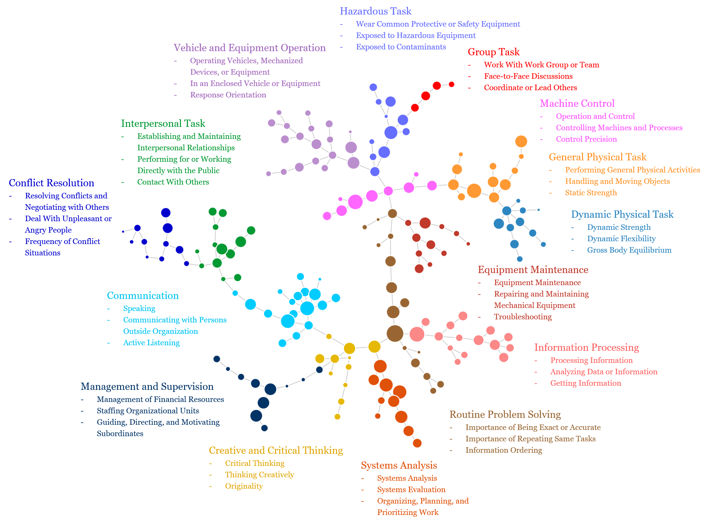
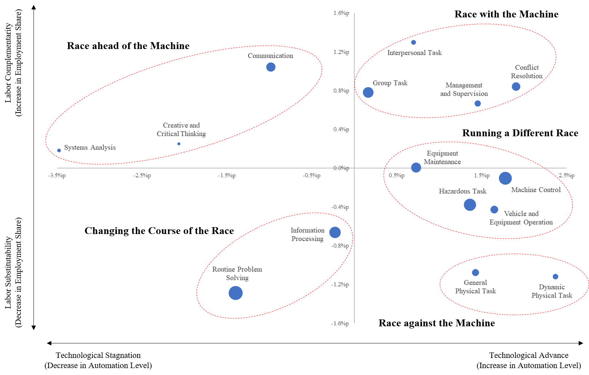

# A Data-Driven Exploration of the Race between Human Labor and Machines

## About the Project
Anxiety about automation is prevalent in this era of rapid technological advances, especially in artificial intelligence, machine learning, and robotics. Accordingly, how human labor competes, or cooperates, with the machine in performing a range of tasks (what we term the “**race between human labor and machines**”) has attracted a great deal of attention among the public, policymakers, and researchers.

While there have been doom-laden prophecies about new technology and automation replacing human tasks at least since the Industrial Revolution, recent technological advances in executing sophisticated and complex tasks—enabled by a combinatorial innovation of new techniques and algorithms, advances in computational power, and exponential increase in data—differentiate the 21st century from previous ones. However, the oft-overlooked reality is that technology directly affects the demand for specific skills or tasks, instead of acting on occupations as a whole, and not all types of tasks are displaced by technology. Rather, technology can substitute for some human tasks, but can also augment human intelligence and complement specific types of tasks in ways that lead to higher demand for occupations in which those tasks are performed. The tension between automation and augmentation has been discussed in research and industry alike. Thus, a full picture of automation and the future of work requires a task-level, rather than occupation-level, understanding of not only technological change—to what extent a human task is automated—but also labor demand for occupations performing a task in recent years. To this end, we propose a data-driven methodology to scrutinize which tasks have been more, or less, susceptible to automation during 2008-2020, with respect to (i) changes in degree of automation and (ii) changes in employment.

By representing occupational skill requirements as a network, we reveal 15 endogenous task types which are clusters of related skills required to a similar extent by occupations, as shown below. 

We then measure each task’s degree of automation in 2008 and 2020, respectively. Based on changes in degree of automation and employment share from 2008 to 2020, the task types are classified into five distinct categories, which illustrates the race between human labor and machines, as shown below. 
- **Race with the Machine**: Tasks have experienced an increase in automation level, while the employment share for the tasks has increased from 2008 to 2020
- **Race ahead of the Machine**: Tasks have experienced a decrease in automation level, while the employment share for the tasks has increased from 2008 to 2020
- **Changing the course of the race**: Tasks have experienced a decrease in automation level, while they were already highly automated and the employment share for the tasks has decreased from 2008 to 2020
- **Race against the Machine**: Tasks have experienced an increase in automation level, while the employment share for the tasks has decreased from 2008 to 2020
- **Running a Different Race**: Tasks have experienced an increase in the degree of automation, while the employment share for the tasks has remained relatively stable during 2008–2020

Note that The point size is proportional to the degree of automation in 2020.

Based on an occupation’s task content and a city’s occupational composition, we construct a task-level job automation index for representative occupations and a task-level city automation index for U.S. cities. The proposed automation indexes are found to be significantly correlated with occupational characteristics (e.g., suitability for machine learning, telework and offshoring) and regional characteristics for innovation capacity. The findings highlight that task-level automation indexes provide a granular understanding of how automation affects occupations and communities.

Based on our analysis, we develop a website for the automation indexes to facilitate discussion and communications on the impacts of automation: [www.jobautomationindex.com](http://www.jobautomationindex.com). The website offers an interactive interface for the task-level degree of automation across occupations and U.S. cities for the following menus. The task-level decomposition of degree of automation will provide a more granular understanding of how technical advances and automation affect occupations and our communities.

#### (1) [Job Automation Index](http://www.jobautomationindex.com/automation_index/)
  - Demonstrate an occupation’s job automation index
#### (2) [Skill Network](http://www.jobautomationindex.com/skill_network/)
  - Visualize an occupation’s skill requirements and degree of automation
#### (3) [Task-Level Job Automation](http://www.jobautomationindex.com/job_automation/)
  - Sort all occupations by task-level job automation index
#### (4) [Automation Map (U.S. Cities)](http://www.jobautomationindex.com/automation_map/)
  - Visualize a city’s degree of automation in the United States
#### (5) [Task-Level City Automation](http://www.jobautomationindex.com/city_automation/)
  - Sort all U.S. cities by task-level city automation index

The entire source code is publicly accessible to encourage reproducibility at [Github Link](https://github.com/jonghkim/job-automation-index). Please see [our research paper](https://papers.ssrn.com/sol3/papers.cfm?abstract_id=3924789) for detailed methodology and results. We welcome any comments and feedback on the research project and the website for job automation index.

## Link
- [Background Paper (to appear in Communications of the ACM)](https://papers.ssrn.com/sol3/papers.cfm?abstract_id=3924789)
- [Website for the Job Automation Index](http://www.jobautomationindex.com/)
- Contact
    - Jiyong Park, Bryan School of Business and Economics, University of North Carolina at Greensboro [jiyong.park@uncg.edu]
    - Jongho Kim, Samuel Curtis Johnson Graduate School of Management, Cornell University [jk2352@cornell.edu]

## Usage of Code
- Python 2.7
- pip install -r requirements.txt
- python job_automation_index.py

## Acknowledgement
The following MIT-licensed code, created by Frank Elavsky, was used to create interactive visualization for the map of automation ([Link](https://github.com/nuitrcs/kellogg_insight_city_automation)). 
